# Claude Code Buddy 宠物系统完全指南

> 2026年4月1日，Claude Code 正式上线了隐藏的虚拟宠物系统 **Buddy** —— 一个类似电子宠物/扭蛋(Gacha)的彩蛋功能。每个用户都会根据自己的账号ID获得一个独一无二的宠物伙伴！

---

## 目录

- [什么是 Buddy 宠物系统？](#什么是-buddy-宠物系统)
- [快速开始（3分钟上手）](#快速开始3分钟上手)
- [宠物图鉴（18种宠物）](#宠物图鉴18种宠物)
- [稀有度系统](#稀有度系统)
- [外观系统](#外观系统)
- [属性系统](#属性系统)
- [生成算法揭秘](#生成算法揭秘)
- [爆金教程：获得传说级宠物](#爆金教程获得传说级宠物)
- [自定义宠物](#自定义宠物)
- [社区工具推荐](#社区工具推荐)
- [常见问题 FAQ](#常见问题-faq)

---

## 什么是 Buddy 宠物系统？

Buddy 是 Claude Code 内置的虚拟宠物系统，灵感来自电子宠物(Tamagotchi)和扭蛋游戏。它的特点是：

- **确定性生成**：你的宠物由你的账号UUID决定，同一个账号永远得到同一只宠物
- **18种物种**：从鸭子到龙，从幽灵到水豚，每种都有独特的ASCII艺术精灵
- **5个稀有度**：普通(60%)、不凡(25%)、稀有(10%)、史诗(4%)、传说(1%)
- **闪光(Shiny)**：每只宠物有1%的概率是闪光版本
- **个性系统**：宠物有AI生成的名字和独特个性
- **ASCII动画**：每种宠物有3帧动画，会在你的终端里活蹦乱跳

### 系统架构一览

```
你的账号UUID + 盐值("friend-2026-401")
        ↓
   FNV-1a 哈希 / Bun.hash
        ↓
   Mulberry32 伪随机数生成器 (32位种子)
        ↓
   ┌─────────────────────────────┐
   │  稀有度 → 物种 → 眼睛       │
   │  → 帽子 → 闪光 → 属性      │
   │  → 灵感种子                 │
   └─────────────────────────────┘
        ↓
   你的唯一宠物诞生！
```

---

## 快速开始（3分钟上手）

### 前提条件

- 已安装 Claude Code (v2.1.89 或更高版本)
- 已登录 Claude Code 账号

### 第一步：查看你的宠物

在 Claude Code 中输入：

```
/buddy
```

你会看到一个命令菜单，包含以下子命令：

| 命令 | 说明 |
|------|------|
| `/buddy hatch` | 孵化你的宠物（首次使用） |
| `/buddy pet` | 抚摸宠物（触发爱心动画，约2.5秒） |
| `/buddy card` | 查看宠物卡片（显示完整信息） |

### 第二步：孵化宠物

输入 `/buddy hatch`，系统会：

1. 根据你的账号UUID计算宠物属性（"骨骼" Bones）
2. 调用AI模型生成宠物的名字和个性（"灵魂" Soul）
3. 将名字和个性保存到 `~/.claude.json` 的 `companion` 字段

### 第三步：和宠物互动

孵化完成后，你的宠物会出现在终端右侧，以ASCII精灵的形式陪伴你编程：

```
   /\_/\
  ( ·   ·)    💬 "这段代码需要更多注释..."
  (  ω  )
  (")_(")
```

- **宽屏模式**：完整显示ASCII精灵 + 气泡对话
- **窄屏模式**：只显示单行表情，如 `=·ω·=`

### 查看你的 Account UUID

方法一：直接问 Claude Code

```
你的 accountUuid 是什么？
```

方法二：终端命令

```bash
# macOS / Linux
cat ~/.claude.json | grep -E '"accountUuid"|"userID"'

# Windows PowerShell
Select-String -Pattern '"accountUuid"|"userID"' -Path "$env:USERPROFILE\.claude.json"
```

方法三：手动查看

打开 `~/.claude.json` 文件，找到 `oauthAccount` 下的 `accountUuid` 字段。

---

## 宠物图鉴（18种宠物）

> 完整的18种宠物ASCII精灵展示，请查看 [宠物图鉴](docs/pet-encyclopedia.md)

### 物种一览表

| 物种 | 中文名 | 窄屏表情 | 特征描述 |
|------|--------|----------|----------|
| duck | 鸭子 | `(·>` | 扁嘴小鸭，尾巴会摇摆 |
| goose | 鹅 | `(·>` | 高昂的头，会伸长脖子 |
| blob | 果冻 | `(··)` | 可以变大变小的软体生物 |
| cat | 猫 | `=·ω·=` | 经典猫脸，带ω嘴和尾巴 |
| dragon | 龙 | `<·~·>` | 双角小龙，会喷烟 |
| octopus | 章鱼 | `~(··)~` | 触手会摆动，会喷墨 |
| owl | 猫头鹰 | `(·)(·)` | 大眼睛，会眨眼 |
| penguin | 企鹅 | `(·>)` | 圆滚滚，翅膀会扇动 |
| turtle | 乌龟 | `[·_·]` | 背壳花纹会变化 |
| snail | 蜗牛 | `·(@)` | 触角会伸缩，壳上有@标记 |
| ghost | 幽灵 | `/··\` | 飘浮不定，下摆会波动 |
| axolotl | 六角恐龙 | `}·.·{` | 外鳃会摆动，超级可爱 |
| capybara | 水豚 | `(·oo·)` | 呆萌大脸，世界上最大的啮齿动物 |
| cactus | 仙人掌 | `\|·  ·\|` | 手臂会上下移动 |
| robot | 机器人 | `[··]` | 方方正正，天线会闪烁 |
| rabbit | 兔子 | `(·..·)` | 长耳朵会动，有胡须 |
| mushroom | 蘑菇 | `\|·  ·\|` | 菌盖花纹会变化，会散发孢子 |
| chonk | 胖球 | `(·.·)` | 圆滚滚的大胖猫，耳朵会动 |

---

## 稀有度系统

宠物的稀有度决定了它的"价值"和属性下限。

### 概率分布

```
传说 ★★★★★  ▓                                          1%
史诗 ★★★★   ▓▓                                         4%
稀有 ★★★    ▓▓▓▓▓                                     10%
不凡 ★★     ▓▓▓▓▓▓▓▓▓▓▓▓▓                             25%
普通 ★      ▓▓▓▓▓▓▓▓▓▓▓▓▓▓▓▓▓▓▓▓▓▓▓▓▓▓▓▓▓▓           60%
```

### 稀有度对照表

| 稀有度 | 星级 | 概率 | 属性下限 | 帽子 | 颜色标识 |
|--------|------|------|----------|------|----------|
| Common (普通) | ★ | 60% | 5 | 无帽子 | 灰色 |
| Uncommon (不凡) | ★★ | 25% | 15 | 随机帽子 | 绿色 |
| Rare (稀有) | ★★★ | 10% | 25 | 随机帽子 | 蓝色 |
| Epic (史诗) | ★★★★ | 4% | 35 | 随机帽子 | 紫色 |
| Legendary (传说) | ★★★★★ | 1% | 50 | 随机帽子 | 金色 |

### 闪光(Shiny)系统

- 任何稀有度的宠物都有 **1%** 的概率是闪光版本
- 闪光标记：✦
- 传说+闪光的概率：1% × 1% = **万分之一 (0.01%)**

---

## 外观系统

### 眼睛（6种）

| 符号 | 名称 |
|------|------|
| `·` | 圆点眼 |
| `✦` | 星星眼 |
| `×` | 叉叉眼 |
| `◉` | 靶心眼 |
| `@` | 漩涡眼 |
| `°` | 空心眼 |

### 帽子（8种）

| 帽子 | ASCII表示 | 说明 |
|------|-----------|------|
| none | *(无)* | 普通级没有帽子 |
| crown | `\^^^/` | 王冠 |
| tophat | `[___]` | 礼帽 |
| propeller | `-+-` | 螺旋桨帽 |
| halo | `(   )` | 光环/天使环 |
| wizard | `/^\` | 巫师帽 |
| beanie | `(___)` | 毛线帽 |
| tinyduck | `,>` | 小鸭子帽（最萌！） |

> **注意**：普通(Common)稀有度的宠物不会获得帽子，不凡及以上稀有度从8种帽子中随机分配。

---

## 属性系统

每只宠物有5项属性，属性值范围 1-100：

| 属性 | 英文 | 含义 |
|------|------|------|
| 调试力 | DEBUGGING | 发现和修复bug的能力 |
| 耐心值 | PATIENCE | 对待长编译时间的态度 |
| 混乱度 | CHAOS | 制造意外惊喜的能力 |
| 智慧值 | WISDOM | 代码审查和建议的质量 |
| 毒舌值 | SNARK | 吐槽代码的尖锐程度 |

### 属性生成规则

1. **属性下限**由稀有度决定（普通5，传说50）
2. 每只宠物有一个**巅峰属性**(Peak)：下限+50 + 随机(0-29)，最高100
3. 每只宠物有一个**短板属性**(Dump)：下限-10 + 随机(0-14)，最低1
4. 其余属性：下限 + 随机(0-39)

---

## 生成算法揭秘

### 核心流程

```javascript
// 1. 获取用户ID
const userId = config.oauthAccount?.accountUuid ?? config.userID ?? "anon"

// 2. 拼接盐值
const key = userId + "friend-2026-401"  // 盐值暗示4月1日

// 3. 哈希生成32位种子
const seed = hashString(key)  // FNV-1a 或 Bun.hash

// 4. 用 Mulberry32 生成伪随机序列
const rng = mulberry32(seed)

// 5. 依次确定各属性
const rarity = rollRarity(rng)     // 稀有度
const species = pick(rng, SPECIES) // 物种
const eye = pick(rng, EYES)        // 眼睛
const hat = rarity === 'common' ? 'none' : pick(rng, HATS) // 帽子
const shiny = rng() < 0.01         // 闪光
const stats = rollStats(rng, rarity) // 属性
```

### Mulberry32 PRNG

```javascript
function mulberry32(seed) {
  let a = seed >>> 0
  return function () {
    a |= 0
    a = (a + 0x6d2b79f5) | 0
    let t = Math.imul(a ^ (a >>> 15), 1 | a)
    t = (t + Math.imul(t ^ (t >>> 7), 61 | t)) ^ t
    return ((t ^ (t >>> 14)) >>> 0) / 4294967296
  }
}
```

### FNV-1a 哈希

```javascript
function hashString(s) {
  let h = 2166136261
  for (let i = 0; i < s.length; i++) {
    h ^= s.charCodeAt(i)
    h = Math.imul(h, 16777619)
  }
  return h >>> 0
}
```

### 反作弊机制

- 宠物的"骨骼"(Bones = 外观+稀有度+属性)每次启动时**从UUID重新计算**，不存储在配置文件中
- 配置文件只存储"灵魂"(Soul = 名字+个性+孵化时间)
- 即使你修改了配置文件中的 `companion` 字段，也无法改变宠物的稀有度或物种

---

## 爆金教程：获得传说级宠物

由于 Mulberry32 只有32位种子空间（约42.9亿个状态），用现代CPU暴力遍历只需几秒钟。

### 方法一：使用本仓库的爆金工具

```bash
# 查找传说级+闪光的UUID
node tools/buddy-roller.js --rarity legendary --shiny

# 查找指定物种的传说级
node tools/buddy-roller.js --rarity legendary --species cat

# 查找完美"God Roll"
node tools/buddy-roller.js --rarity legendary --shiny --min-stat 90
```

### 方法二：在线查看器

1. 打开 `tools/buddy-checker.html`（或访问 https://claudebuddychecker.netlify.app/）
2. 输入你的 accountUuid
3. 即时查看你的宠物信息

### 方法三：直接使用 God Roll UUID

我们已经预计算了 Top 20 "God Roll"（传说+闪光+满属性），详见 [god-rolls.md](god-rolls.md)。

### 如何替换你的宠物

1. **备份**你的配置文件：

```bash
cp ~/.claude.json ~/.claude.json.backup
```

2. 编辑 `~/.claude.json`，修改 `oauthAccount.accountUuid`：

```json
{
  "oauthAccount": {
    "accountUuid": "3f6c5f24-86f4-4131-b02b-d8f1dd1c36b8"
  }
}
```

3. 删除 `companion` 字段（让系统重新生成名字和个性）：

```json
{
  "companion": null
}
```

4. 重启 Claude Code，输入 `/buddy hatch` 重新孵化

> **或者使用一键脚本**：`bash tools/quick-swap.sh <UUID>`

### Top 5 God Roll 速查

| # | 物种 | 帽子 | 眼睛 | 最强属性 | UUID |
|---|------|------|------|----------|------|
| 1 | owl 猫头鹰 | halo 光环 | ✦ | SNARK 100 | `3f6c5f24-86f4-4131-b02b-d8f1dd1c36b8` |
| 2 | turtle 乌龟 | crown 王冠 | @ | SNARK 100 | `575d0192-5eec-4c6c-829c-c2ea74e52d5e` |
| 3 | goose 鹅 | beanie 毛线帽 | ° | DEBUG 100 | `41c9d643-7b7f-49c5-b23d-d07700448db9` |
| 4 | octopus 章鱼 | 无 | × | CHAOS 100 | `c104cad9-b477-4794-9a72-0dcc528ec4a4` |
| 5 | duck 鸭子 | wizard 巫师 | ◉ | CHAOS 100 | `4b9afb15-f776-4005-a5ea-81c4f0f5f340` |

> 以上全部是 ★★★★★ 传说级 + ✦ 闪光！

---

## 自定义宠物

### 自定义名字和个性

编辑 `~/.claude.json`：

```json
{
  "companion": {
    "name": "哆啦A梦",
    "personality": "从四次元口袋里掏出代码片段，最讨厌老鼠（和内存泄漏）。"
  }
}
```

- `name`：最多12个字符
- `personality`：一句话描述宠物的个性和编程吐槽风格

### 自定义 ASCII 精灵

参见 [自定义精灵指南](custom/personality-editor.md) 和 [自定义精灵模板](custom/custom-sprites.js)，内置了 **15+ 种**卡通角色和动物的ASCII模板：

**卡通人物**: 哆啦A梦、皮卡丘、龙猫、卡比、史努比、Hello Kitty

**动物系列**: 柴犬、熊猫、独角兽、狐狸、树懒、鲸鱼、小恐龙、仓鼠、小熊、蝴蝶、小企鹅、小白兔

**特殊角色**: 外星人、南瓜头

运行 `node custom/custom-sprites.js` 可查看全部精灵预览。

---

## 小白一键部署

### 最简单的方式（推荐）

```bash
bash tools/one-click-setup.sh
```

脚本会显示交互菜单：

```
╔══════════════════════════════════════════════════════╗
║   ★★★★★  Claude Code Buddy 一键部署  ★★★★★       ║
╚══════════════════════════════════════════════════════╝

  1. 查看当前宠物信息
  2. 一键爆金 - 获得传说级闪光宠物
  3. 自定义宠物名字和个性
  4. 恢复原始配置
  5. 查看 God Roll 列表
  0. 退出
```

### 一键爆金流程

1. 运行脚本，选择 `2. 一键爆金`
2. 从 Top 20 God Roll 列表中选择你喜欢的宠物
3. 脚本自动备份配置 → 替换UUID → 清除旧宠物数据
4. 重启 Claude Code，输入 `/buddy hatch` 孵化

> 全程自动备份，支持一键恢复，零风险操作！

---

## 金色宠物图鉴

Top 12 传说级闪光金色宠物展示卡（完整20只见 [god-rolls.md](god-rolls.md)）：

| 编号 | 物种 | 帽子 | 最强属性 | 预览 |
|------|------|------|----------|------|
| #1 | 猫头鹰 Owl | 光环 | SNARK 100 | 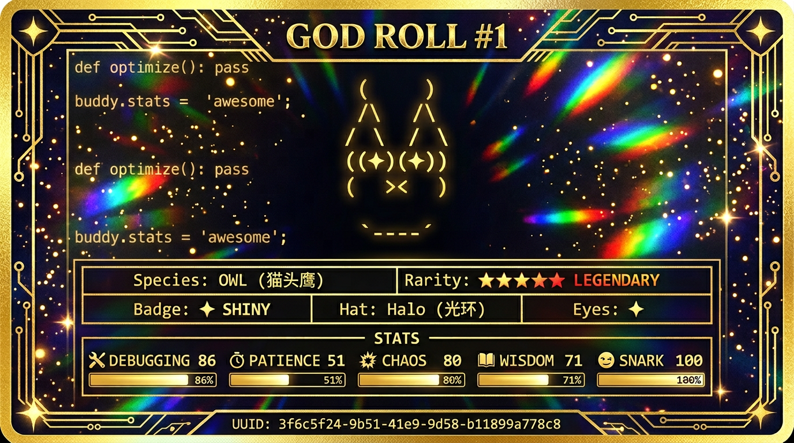 |
| #2 | 乌龟 Turtle | 王冠 | SNARK 100 | 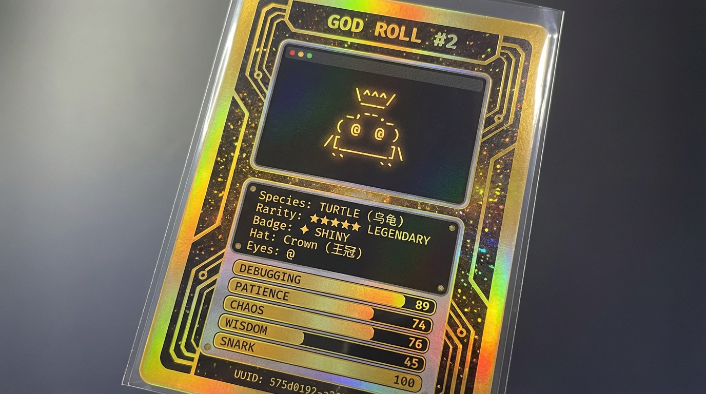 |
| #3 | 鹅 Goose | 毛线帽 | DEBUG 100 | 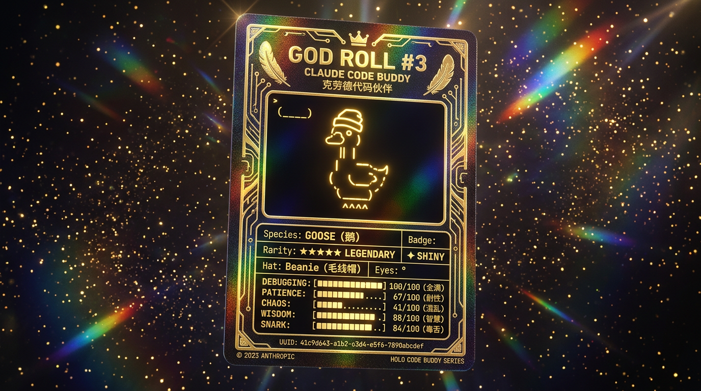 |
| #4 | 章鱼 Octopus | 无 | CHAOS 100 | 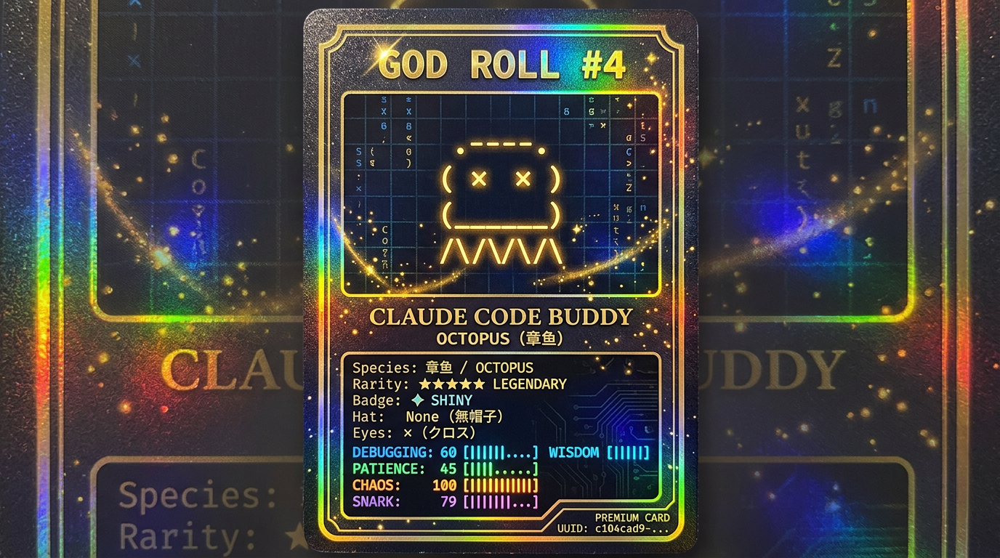 |
| #5 | 鸭子 Duck | 巫师帽 | CHAOS 100 | 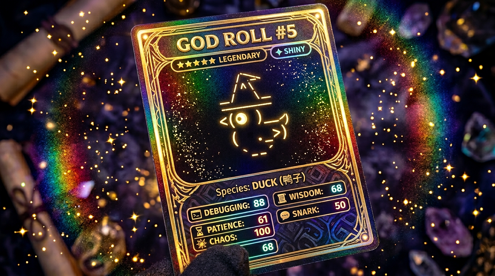 |
| #7 | 蘑菇 Mushroom | 无 | DEBUG 100 | 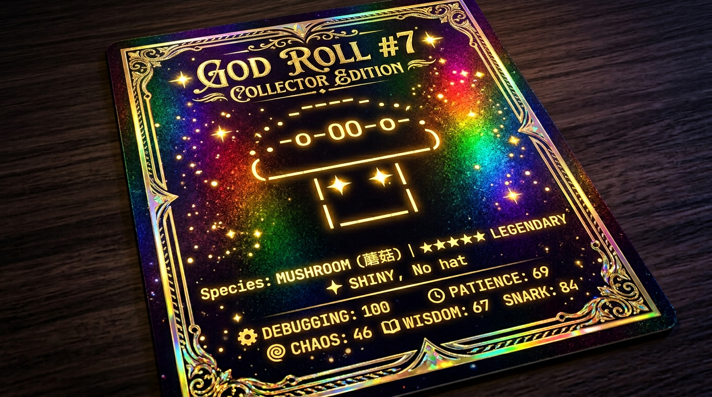 |
| #9 | 幽灵 Ghost | 巫师帽 | CHAOS 100 |  |
| #13 | 水豚 Capybara | 王冠 | SNARK 100 | 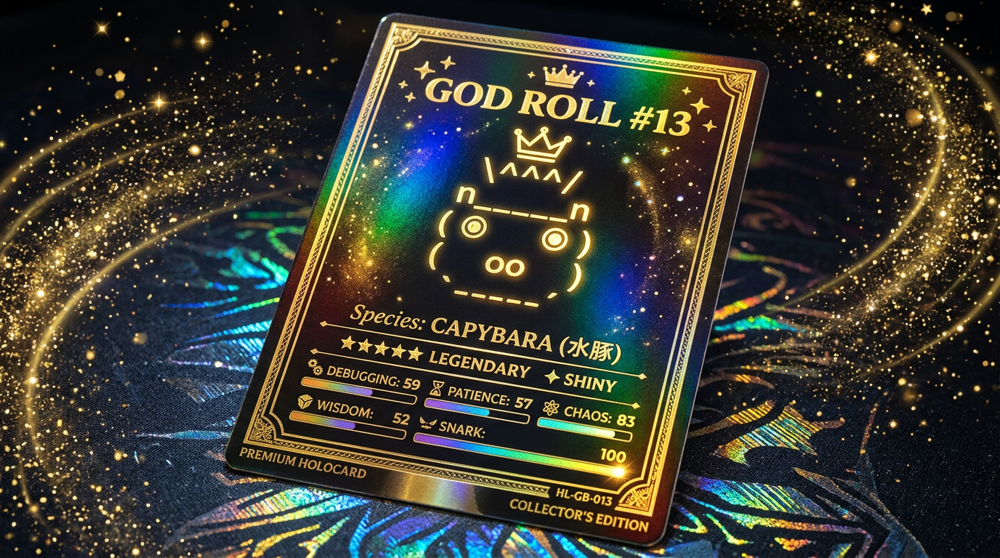 |
| #15 | 企鹅 Penguin | 小鸭子 | PATIENCE 100 | 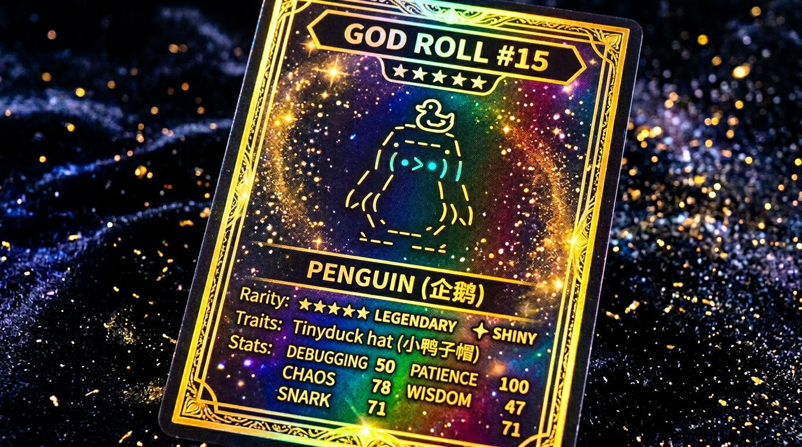 |
| #17 | 猫 Cat | 光环 | DEBUG 100 | 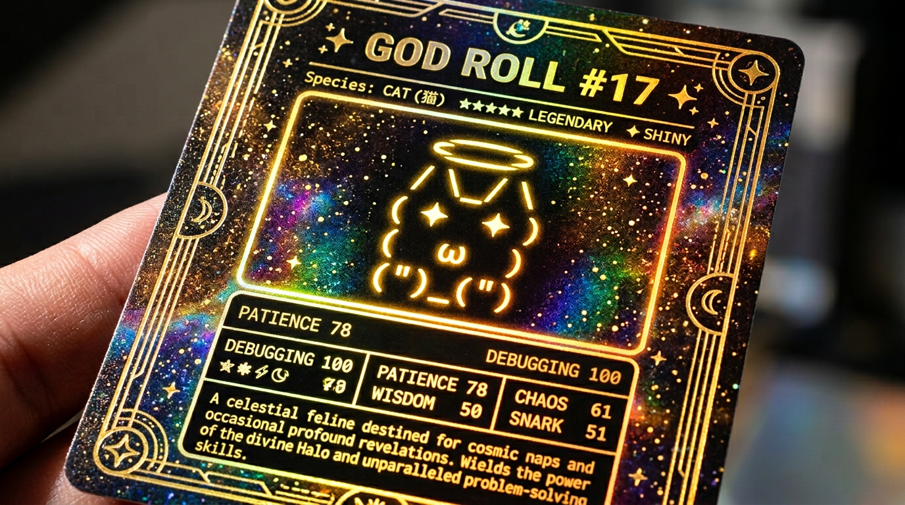 |
| #18 | 蜗牛 Snail | 礼帽 | WISDOM 100 | 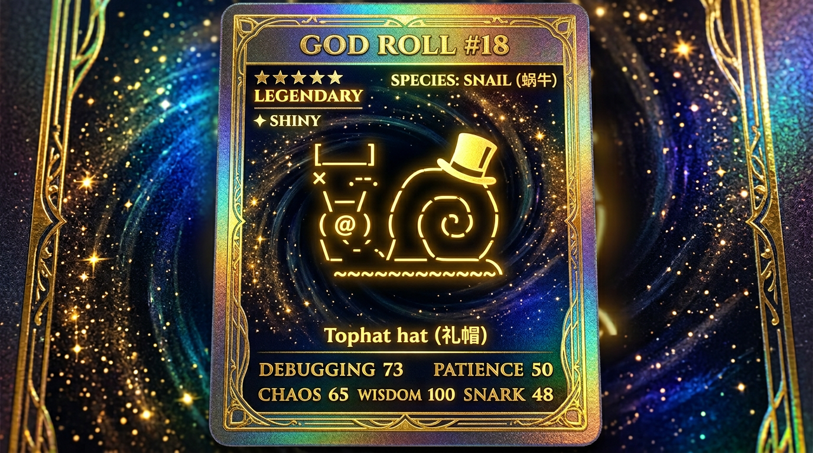 |
| #19 | 机器人 Robot | 巫师帽 | CHAOS 100 | 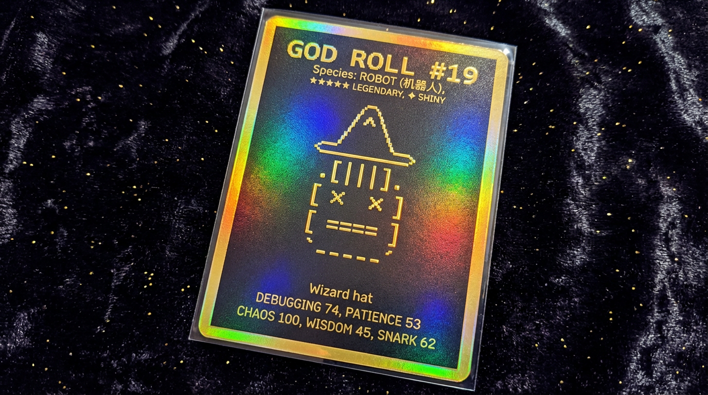 |

---

## 漫画展示

| 漫画 | 说明 |
|------|------|
| 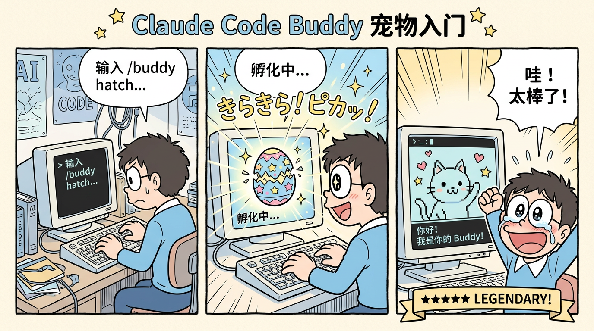 | 宠物系统入门 |
|  | 一键爆金教程 |
|  | 小白一键部署 |
|  | 自定义宠物创建 |
| 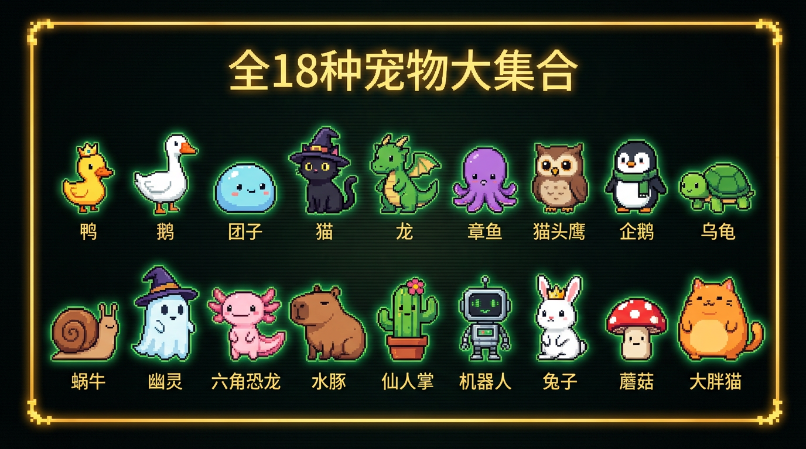 | 全18种宠物大集合 |
| 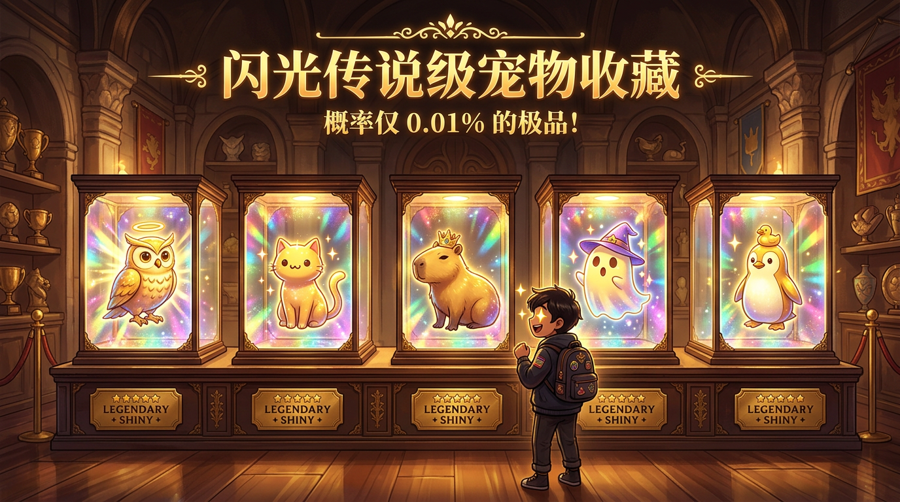 | 闪光宠物收藏 |

---

## 社区工具推荐

### 官方/半官方工具

| 工具 | 说明 | 链接 |
|------|------|------|
| Claude Buddy Checker | 在线查看你的宠物 | [claudebuddychecker.netlify.app](https://claudebuddychecker.netlify.app/) |
| variety.is Buddy Builder | 自选外观+暴力破解UUID | [variety.is/posts/claude-code-buddies](https://variety.is/posts/claude-code-buddies/) |

### 社区宠物项目

| 项目 | 说明 | 链接 |
|------|------|------|
| ccpet | 状态栏宠物，token消耗喂养 | [github.com/terryso/ccpet](https://github.com/terryso/ccpet) |
| claude-pet (IMMINJU) | Tauri桌面宠物小部件 | [github.com/IMMINJU/claude-pet](https://github.com/IMMINJU/claude-pet) |
| claude-pet (scm1400) | 可自定义皮肤的桌面宠物 | [github.com/scm1400/claude-mama](https://github.com/scm1400/claude-mama) |
| claude-pet-companion | Python桌面宠物，10阶进化 | [pypi.org/project/claude-pet-companion](https://pypi.org/project/claude-pet-companion/2.4.0/) |

---

## 常见问题 FAQ

### Q: 宠物系统什么时候上线的？
**A:** 2026年4月1日（愚人节彩蛋），随 Claude Code v2.1.89 正式发布。盐值 `friend-2026-401` 中的 `401` 就暗示了4月1日。

### Q: 我可以换一只宠物吗？
**A:** 可以。修改 `~/.claude.json` 中的 `oauthAccount.accountUuid` 为其他UUID，重启后会得到不同的宠物。修改UUID不会影响 Claude Code 的正常使用。

### Q: 修改UUID有风险吗？
**A:** 目前社区反馈修改 `accountUuid` 不会影响功能，但建议先备份配置文件。

### Q: 为什么我看不到宠物？
**A:** 确保：
1. Claude Code 版本 >= v2.1.89
2. 已输入 `/buddy hatch` 孵化
3. 终端宽度足够（太窄会只显示单行表情）
4. Buddy 功能已启用（feature flag `BUDDY` 开启）

### Q: Shiny（闪光）宠物有什么特别的？
**A:** 闪光宠物在数据中标记为 `shiny: true`，概率仅1%。闪光状态会影响宠物名字和个性的生成（提示词中会加入 "SHINY variant — extra special"）。

### Q: TypeScript、Rust 和 Python 实现有什么区别？
**A:**
- **TypeScript**（主实现）：完整的UI、React组件、Bun.hash / FNV-1a 双路径
- **Rust**（移植版）：算法相同但使用 SHA-256 作为哈希，与TS的种子不完全一致
- **Python**：仅占位文件，从JSON读取元数据，无游戏逻辑

### Q: 宠物的名字是怎么生成的？
**A:** 系统会把宠物的属性（稀有度、物种、属性值）和4个随机"灵感词"发给AI模型，模型生成一个最多12字符的名字和一句个性描述。如果API调用失败，会使用6个预设名字之一：Crumpet、Soup、Pickle、Biscuit、Moth、Gravy。

### Q: 宠物动画是怎么工作的？
**A:** 
- 刷新率：500ms/帧
- 空闲序列：`[0,0,0,0,1,0,0,0,-1,0,0,2,0,0,0]`（15步循环）
- `-1` 表示眨眼帧（用帧0但把眼睛替换为 `-`）
- 抚摸(`/buddy pet`)时触发约2.5秒的心形动画

---

## 项目文件说明

```
claude-code-buddy-guide/
├── README.md                      ← 你正在看的这个文件
├── god-rolls.md                   ← Top 20 God Roll UUID 完整列表
├── docs/
│   ├── guide.html                 ← HTML版教程（可浏览器打印为PDF）
│   └── pet-encyclopedia.md        ← 18种宠物完整图鉴
├── tools/
│   ├── one-click-setup.sh         ← 小白一键部署脚本（推荐）
│   ├── buddy-roller.js            ← 暴力破解传说级UUID工具
│   ├── buddy-checker.html         ← 浏览器版宠物查看器+爆金搜索
│   └── quick-swap.sh              ← 一键换宠脚本
├── custom/
│   ├── custom-sprites.js          ← 15+种自定义ASCII精灵模板
│   ├── doraemon-sprite.txt        ← 哆啦A梦ASCII精灵
│   └── personality-editor.md      ← 自定义性格编辑指南
├── comics/
│   ├── 01-getting-started.png     ← 入门漫画
│   ├── 02-gold-rush.png           ← 爆金漫画
│   ├── 05-one-click-gold.png      ← 小白一键部署漫画
│   ├── 06-custom-pet.png          ← 自定义宠物漫画
│   ├── 07-pet-gallery.png         ← 全18种宠物大集合
│   ├── 08-shiny-collection.png    ← 闪光宠物收藏漫画
│   └── gold-pets/                 ← 12张金色宠物全息卡片
└── LICENSE
```

---

## 致谢

- [variety.is](https://variety.is/posts/claude-code-buddies/) - 逆向工程分析和 Buddy Builder
- [dev.to radarlog](https://dev.to/_53fb7c03dd741a6124e4e/i-tore-apart-the-claude-code-source-code-33-2jb1) - 源码深度分析
- [Claude Buddy Checker](https://claudebuddychecker.netlify.app/) - 在线宠物查看器
- [terryso/ccpet](https://github.com/terryso/ccpet) - 状态栏电子宠物
- [dyz2102/buddy-card](https://github.com/dyz2102/buddy-card) - 全息交易卡生成器
- [ywong137/claude-code-custom-art](https://github.com/ywong137/claude-code-custom-art) - 自定义启动艺术

## License

MIT License
